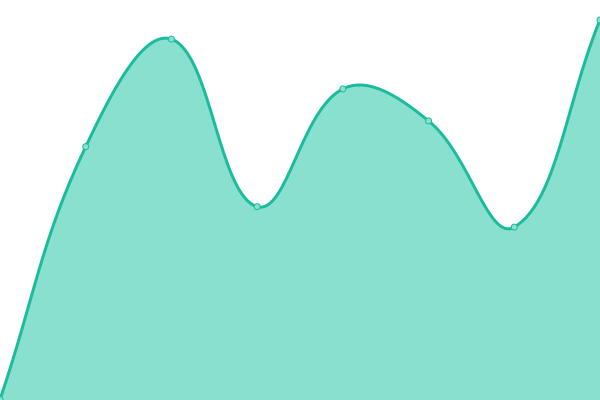

# Service status: <!--live status--> **🟩 All systems operational**

This repository contains the source code and historical data for the [Severn Bronies service status and uptime monitor](https://severnbronies.github.io/status), powered by [Upptime](https://github.com/upptime/upptime).

[**Visit our status website →**](https://severnbronies.github.io/status)

<!--start: status pages-->
<!-- This summary is generated by Upptime (https://github.com/upptime/upptime) -->
<!-- Do not edit this manually, your changes will be overwritten -->
<!-- prettier-ignore -->
| URL | Status | History | Response Time | Uptime |
| --- | ------ | ------- | ------------- | ------ |
|  [Severn Bronies website](https://severnbronies.co.uk) | 🟩 Up | [severn-bronies-website.yml](https://github.com/severnbronies/status/commits/master/history/severn-bronies-website.yml) | 

 1420ms
     
 | 

<a href="https://severnbronies.github.io/status/history/severn-bronies-website">100.00%</a>
    

|  [Blog](https://blog.severnbronies.co.uk) | 🟩 Up | [blog.yml](https://github.com/severnbronies/status/commits/master/history/blog.yml) | 

 668ms
     
 | 

<a href="https://severnbronies.github.io/status/history/blog">100.00%</a>
    

|  [URL shortener](https://svrnbrn.es) | 🟩 Up | [url-shortener.yml](https://github.com/severnbronies/status/commits/master/history/url-shortener.yml) | 

 1572ms
     
 | 

<a href="https://severnbronies.github.io/status/history/url-shortener">100.00%</a>
    

|  [Minecraft server](https://mc.severnbronies.co.uk) | 🟩 Up | [minecraft-server.yml](https://github.com/severnbronies/status/commits/master/history/minecraft-server.yml) | 

 602ms
     
 | 

<a href="https://severnbronies.github.io/status/history/minecraft-server">99.86%</a>
    

<!--end: status pages-->

## 🛠️ Workflow status

