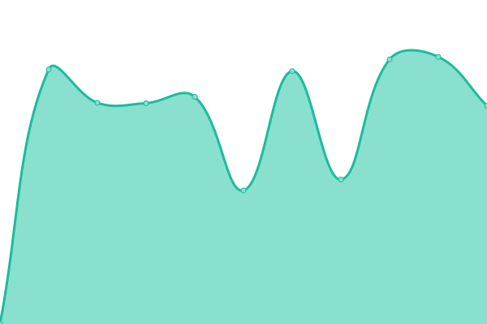
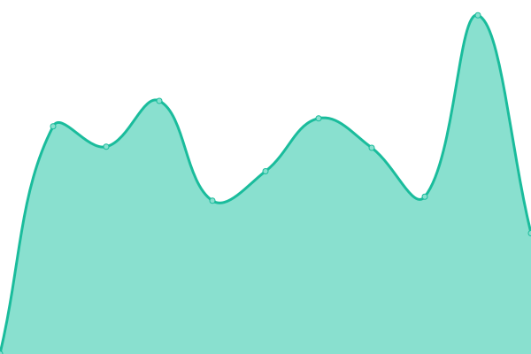
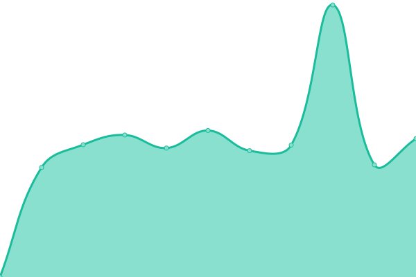
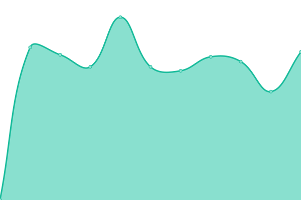

# Service status: <!--live status--> **🟩 All systems operational**

This repository contains the source code and historical data for the [Severn Bronies service status and uptime monitor](https://severnbronies.github.io/status), powered by [Upptime](https://github.com/upptime/upptime).

[**Visit our status website →**](https://severnbronies.github.io/status)

<!--start: status pages-->
<!-- This summary is generated by Upptime (https://github.com/upptime/upptime) -->
<!-- Do not edit this manually, your changes will be overwritten -->

| URL                                                   | Status | History                                                                                                                 | Response Time                                                                                | Uptime                                                                                                                                                                                                                                                |
| ----------------------------------------------------- | ------ | ----------------------------------------------------------------------------------------------------------------------- | -------------------------------------------------------------------------------------------- | ----------------------------------------------------------------------------------------------------------------------------------------------------------------------------------------------------------------------------------------------------- |
| [Severn Bronies website](https://severnbronies.co.uk) | 🟩 Up  | [severn-bronies-website.yml](https://github.com/severnbronies/status/commits/master/history/severn-bronies-website.yml) |  1818ms |  |
| [Blog](https://blog.severnbronies.co.uk)              | 🟩 Up  | [blog.yml](https://github.com/severnbronies/status/commits/master/history/blog.yml)                                     |  892ms                    |                                     |
| [URL shortener](https://svrnbrn.es)                   | 🟩 Up  | [url-shortener.yml](https://github.com/severnbronies/status/commits/master/history/url-shortener.yml)                   |  2093ms          |                    |
| [Minecraft server](https://mc.severnbronies.co.uk)    | 🟩 Up  | [minecraft-server.yml](https://github.com/severnbronies/status/commits/master/history/minecraft-server.yml)             |  711ms        |             |

<!--end: status pages-->

## 🛠️ Workflow status

