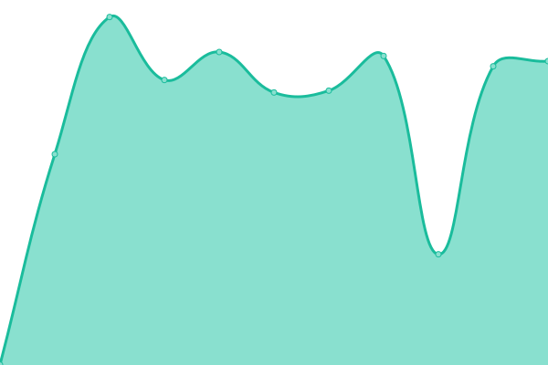

# [📈 Live Status](https://demo.upptime.js.org): <!--live status--> **🟩 All systems operational**

This repository contains the open-source uptime monitor and status page for [Upptime](https://upptime.js.org), powered by [Upptime](https://github.com/upptime/upptime).

With [Upptime](https://upptime.js.org), you can get your own unlimited and free uptime monitor and status page, powered entirely by a GitHub repository. We use [Issues](https://github.com/upptime/upptime/issues) as incident reports, [Actions](https://github.com/upptime/upptime/actions) as uptime monitors, and [Pages](https://demo.upptime.js.org) for the status page.

<!--start: status pages-->
<!-- This summary is generated by Upptime (https://github.com/upptime/upptime) -->
<!-- Do not edit this manually, your changes will be overwritten -->

| URL                                                   | Status | History                                                                                                                 | Response Time                                                                                | Uptime                                                                                                                                                                                                                                                 |
| ----------------------------------------------------- | ------ | ----------------------------------------------------------------------------------------------------------------------- | -------------------------------------------------------------------------------------------- | ------------------------------------------------------------------------------------------------------------------------------------------------------------------------------------------------------------------------------------------------------ |
| [Severn Bronies website](https://severnbronies.co.uk) | 🟩 Up  | [severn-bronies-website.yml](https://github.com/severnbronies/status/commits/master/history/severn-bronies-website.yml) |  1745ms |  |
| [Blog](https://blog.severnbronies.co.uk)              | 🟩 Up  | [blog.yml](https://github.com/severnbronies/status/commits/master/history/blog.yml)                                     |  698ms                    |                                      |
| [URL shortener](https://svrnbrn.es)                   | 🟩 Up  | [url-shortener.yml](https://github.com/severnbronies/status/commits/master/history/url-shortener.yml)                   |  1857ms          |                    |
| [Minecraft server](https://mc.severnbronies.co.uk)    | 🟩 Up  | [minecraft-server.yml](https://github.com/severnbronies/status/commits/master/history/minecraft-server.yml)             |  806ms        |              |

<!--end: status pages-->

[**Visit our status website →**](https://demo.upptime.js.org)

## 📄 License

- Code: [MIT](./LICENSE) © [Upptime](https://upptime.js.org)
- Data in the `./history` directory: [Open Database License](https://opendatacommons.org/licenses/odbl/1-0/)
